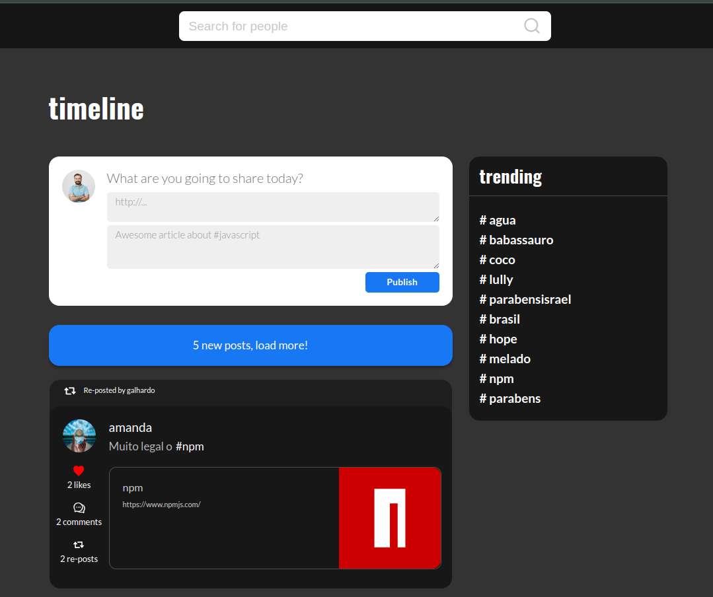

<div align="center">
  <h1>LINKR</h1>
  <br>
  - Front-end de uma rede social para compartilhamento de links. Esse é um projeto full stack e criado em colaboração com mais 3 colegas. <a href = "https://github.com/guedesclaudio/linkr-back">Repositório do back-end</a>
  <br>
  <br>
  <a href = "http://linkr-gules-sigma.vercel.app/">
    
    <p>Clique na imagem para acessar a página</p>
  </a>
</div>
<br>
  
# Funcionalidades
- Tela de login e cadastro
- Tela de Timeline
- Tela de usuário
- Tela de hashtags
- Responsivo para todos os tamanhos
- Posts com contagem de curtidas e reposts


# Tecnologias utilizadas
- JAVASCRIPT
- REACT
- AXIOS
- REACT-ICONS
- REACT-INFINITE-SCROLL-COMPONENT
- REACT-LOADING
- REACT-MODAL
- REACT-ROUTER-DOM
- REACT-TAGIFY
- REACT-TOOLTIP
- STYLED-COMPONENTS
- GIT
- GITHUB
- VSCODE
- LINUX

# Como rodar
1. Clone esse repositório
2. Instale as dependências:
```bash
npm i
```
3. Rode o projeto:
```bash
npm run start
```

<br>
